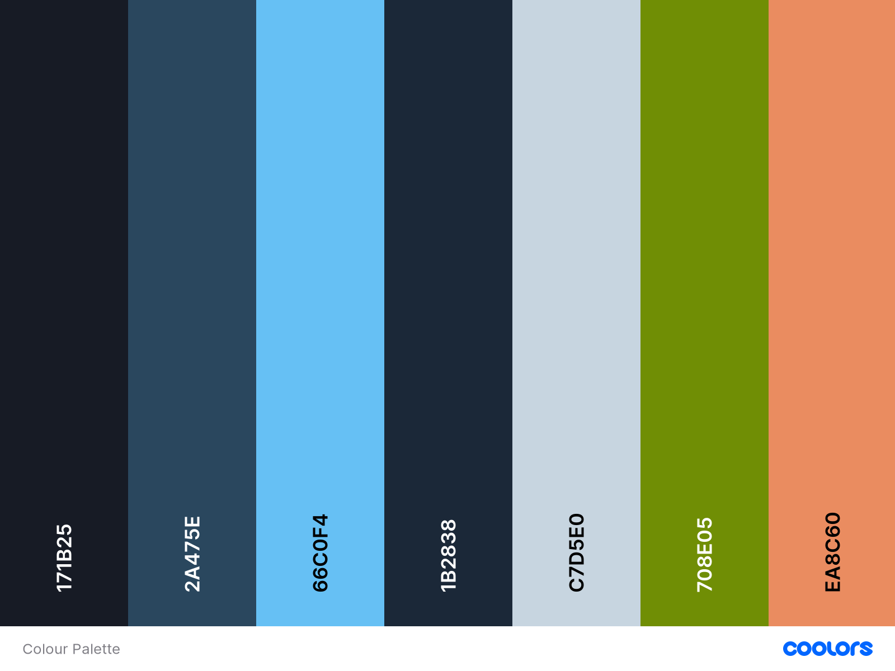

# Game Zone

The purpose of this project is to build a Business-to-Consumer (B2C) E-commerce website for an online Gaming Store called "Game Zone".

## Table of Contents
- [User Experience](#user-experience)
    - [Strategy](#strategy)
        - [User Stories](#user-stories)
        - [Project Goal](#project-goal)
        - [Strategy Tradeoffs](#strategy-tradeoffs)
    - [Scope](#scope)
    - [Structure](#structure)
    - [Skeleton](#skeleton)
    - [Surface](#surface)
- [Database Schema](#database-schema)
- [Technologies](#technologies)
- [Testing](#testing)
- [Deployment](#deployment)
- [Credits](#credits)

---
## User Experience

### Strategy

#### User Stories
As a **first-time visitor**, I want:

1. To be able to view games on the site.
2. To be able to search/sort/filter the games on the site.
3. To register securely for the site.
4. To know the price of each game.
5. To be able to add games to the cart.
6. To be able to contact the company.
7. To be able to get visual feedback when an action is completed.
8. To see a visually appealing website.
9. The website to be intuitive and simple to use.

As a **registered user**, in addition to the above, I want:

1. To be able to easily login to the site.
2. To be able to easily add and remove items to and from the cart.
3. To be able to securely purchase items on cart.
4. To receive a purchase confirmation email.
5. To be able to easily update my contact, profile and delivery information.
6. To be able to view previous orders.

As the **site owner**, I want:

1. To be able to add new games or updating existing games in the store.
2. To be able to delete games in the store.
3. To provide a visually appealing website for all screen sizes and devices.
4. To provide a secure payment system for users of the site.
5. For users to be able to recover their account details.
6. To be able to access the admin section of the site to view orders made, the items they contain and the delivery information.

#### Project Goal

- Project goal:
    - The goal of this project is to build a Full-Stack site based around business logic used to control a centrally-owned dataset. An authentication mechanism will be set up and paid access will be provided to the site's data and/or other activities based on the dataset, such as the purchase of a product/service.

- Focus:
    - The main focus of this project is to create a visually appealing and intuitive Full-Stack online game store called "Game Zone" that will allow users to find and buy games of their choosing.

- Definition:
    - I am creating an e-commerce website, using HTML, CSS, JavaScript, Python and Django, with MySQL and Postgres used for the relational database.
    - Stripe payments will be used for purchasing items in the checkout.

- Value:
    - The value this project will provide, is that it will showcase to future employers my ability to piece together a Full-Stack website, demonstrating proficiency in using HTML, CSS, JavaScript, Python and specifically my ability to use the Django Framework.
    - The value for users of the application is that it will allow them to search for games, add games to their cart and then purchase those games at the checkout.
    - The value for a possible site owner, is that it will allow them to earn money on each game purchased on the site.

#### Strategy Tradeoffs
Opportunity/Problem | Importance  (1-5) | Viability/Feasibility  (1-5)
:-------- |:--------:|:--------:
Search | 5 | 4
Sort / Filter | 5 | 4
Add / Edit / Delete Games | 5 | 4
Register | 5 | 5
Log In / Out | 5 | 5
User Authentication | 5 | 4
Secure purchase | 5 | 4
Purchase confirmation email | 5 | 3
Contact site owner | 3 | 4
Recover account details | 5 | 3
Add / Remove items to / from cart | 5 | 3
Add / Edit / Delete reviews | 2 | 3
Update Profile Information | 3 | 5
View Previous orders | 4 | 4
Wishlist | 3 | 5

### Scope

- Main features (For Minimal Viable Product)
    - Navigation Menu
    - Pagination for Products page
    - Search / Sort / Filter functionality
    - Register
    - Log In
    - Log Out
    - User Authentication
    - Secure purchase payments
    - Purchase confirmation email
    - Add / Remove items to / from cart

- Secondary / Future Features:
    - Editable User Profile page
    - Contact page
    - Recover account details
    - Add / Edit / Delete reviews
    - View previous orders
    - Wishlist

### Structure

1. Home Page

- For the Header:
    - Top half will contain the site logo on the left, a search bar in the centre, and then a user profile and cart image on the right.
    - The bottom half of the header in the centre will contain a number of links to different pages i.e. Home, Product, Contact, Wishlist.

- Below the Header there will be a Hero image with a gaming background. This will contain a welcome and also a link which will bring the user to the Products page.

- Underneath the Hero image there will be a number of different cards for the different Product categories.

- The Footer at the bottom will contain copyright information, contact information, and social media links.

2. Product Page

- Will showcase all the products available in the store.
- Will have a filtration menu on the left to filter products by category.
- Will have an input box on top of the products that allows user to sort by price, newest, highest rated etc.

3. Product Information Page

- Will contain an enlarged image of the product.
- Will contain a description and price information about the game.
- There will be plus and minus input boxes for the quantities of the game.
- There will be a button to add the item to the user's cart.
- May contain reviews about the game as well.

4. Register Page

- Register form for the user.

5. Login Page

- Login form for the user.

6. Cart Page

- For the main area, three quarters of the page will be taken up with a table which displays information about all the products contained in your cart.
- The last quarter of the page on the right will contain the grand total cost of all the items.

7. Checkout Page

- Will contain a form on the left that allows user to enter their contact details and card payment information.
- The order summary will be displayed on the right.

8. Contact Page

- Form that allows users to contact the site administrator for any queries.

9. Profile Page

- Will contain a form on the left that allows users to update their profile delivery information/
- A summary of previous orders will be contained on the right.

10. Wishlist Page

- Will showcase all the games the user has added to their Wishlist.
- Will show the game image on the left, with game information on the right.
- There will be a button to add the game to the cart.
- There will be a link to remove the game from the wishlist.

11. 404 Error Page

- Will show a not found image on the left.
- Will show the 404 Error information on the right with a link to return to the Home Page.

### Skeleton
- Wireframes for the project can be found [here](https://github.com/JamesSinnott1994/Game-Zone/blob/master/wireframes/wireframes.pdf)

### Surface
- #### Typography:
    - Helvetica will be the font that is used for header, titles and links.
    - Roboto will be the font used for the paragraph text.

- #### Colour scheme:
    

    - For the navbar and footbar, the colour used will be Raisin Blue (Dark Navy Blue)
    - The Primary background colour will be Indigo Dye (Light Navy Blue)
    - The Secondary background colour will be Gunmetal (Slighter Dark Navy Blue)
    - For buttons the colour will be Maya Blue.
    - For text, the colour will be Beau Blue (Light Grey)
    - For the "Add to Cart" button the colour will be Green.
    - For any notifications that should catch the eye i.e. number of items in cart, the orangish colour (Copper Crayola) will be used.

- #### Media:
    - There will be a Hero Image for the Home page.
    - There will be many images for the different games on the site.

- #### Effects:
    - Hover effects over game images, links, buttons and input boxes.

## Database Schema

**Profile App:**

UserProfile Model

| Field | Field Type | Field Options |
| --- | :--- | ---|
| user | OneToOneField | User, on_delete=models.CASCADE |
| default_full_name | CharField | max_length=80, null=True, blank=True |
| default_email | EmailField | max_length=254, null=True, blank=True |
| default_contact_number | CharField | max_length=20, null=True, blank=True |
| default_address_line_1 | CharField | max_length=50, null=True, blank=True |
| default_address_line_2 | CharField | max_length=50, null=True, blank=True |
| default_town_or_city | CharField | max_length=50, null=True, blank=True |
| default_county | CharField | max_length=50, null=True, blank=True |
| default_postcode | CharField | max_length=20, null=True, blank=True |
| default_country | CountryField | blank_label="Country", null=True, blank=True |

Wishlist Model (Custom model #1)

| Field | Field Type | Field Options |
| --- | --- | --- |
| product | ForeignKey | Product, null=False, blank=False, on_delete=models.CASCADE |

**Products App:**

Category Model

| Field | Field Type | Field Options |
| --- | --- | --- |
| name | CharField | max_length=254 |

Product Model

| Field | Field Type | Field Options |
| --- | --- | --- |
| name | CharField | max_length=254, null=True |
| category | ForeignKey | 'Category', null=True, blank=True, on_delete=models.SET_NULL |
| price | DecimalField | max_digits=6, deciaml_places=2
| description | TextField | null=True, blank=True |
| image | ImageField | null=True, blank=True |

**Checkout App:**

Order Model

| Field | Field Type | Field Options |
| --- | --- | ---|
| order_number | CharField | max_length=32, null=False, editable=False |
| user_profile | ForeignKey | UserProfile, on_delete=models.SET_NULL, null=True, blank=False, related_name='orders' |
| full_name | CharField | max_length=80, null=False, blank=False |
| email | EmailField | max_length=254, null=False, blank=False |
| contact_number | CharField | max_length=20, null=True, blank=True |
| address_line_1 | CharField | max_length=50, null=False, blank=False |
| address_line_2 | CharField | max_length=50, null=False, blank=False |
| town_or_city | CharField | max_length=50, null=False, blank=False |
| county | CharField | max_length=50, null=True, blank=True |
| postcode | CharField | max_length=20, null=True, blank=True |
| country | CountryField | blank_label="Country *", null=False, blank=False |
| coupon | ForeignKey | Coupon, on_delete=models.SET_NULL, null=True, blank=True |
| date | DateTimeField | auto_now_add=True |
| order_total | DecimalField | max_digits=10, decimal_places=2, null=False, default=0 |
| original_crate | TextField | null=False, blank=False, default='' |
| stripe_pid | CharField | max_length=254, null=False, blank=False, default='' |

OrderLineItem Model

| Field | Field Type | Field Options |
| --- | :--- | ---|
| order | ForeignKey | Order, null=False, blank=False, on_delete=models.CASCADE, related_name="crateitems" |
| product | ForeignKey | Product, null=False, blank=False, on_delete=models.CASCADE |
| quantity | IntegerField | null=False, blank=False, default=0
| lineitem_total | DecimalField | max_digits=6, decimal_places=2, null=False, blank=False, editable=False

**Reviews App:**

Review Model (Custom model #2)

| Field | Field Type | Field Options |
| --- | --- | --- |
| review | TextField | null=True, blank=False |
| added_by | ForeignKey | User, on_delete=models.CASCADE |
| rating | IntegerField | default=0, validators=[MinValueValidator(1),MaxValueValidator(5)] |