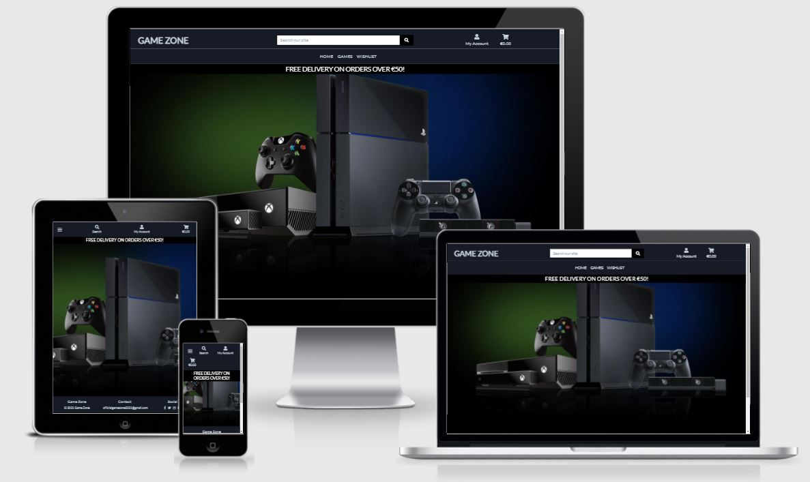

# Game Zone

The purpose of this project is to build a Business-to-Consumer (B2C) E-commerce website for an online Gaming Store called "Game Zone".

Link to site [here.](https://js-game-zone.herokuapp.com/)

## Table of Contents
- [User Experience](#user-experience)
    - [Strategy](#strategy)
        - [User Stories](#user-stories)
        - [Project Goal](#project-goal)
        - [Strategy Tradeoffs](#strategy-tradeoffs)
    - [Scope](#scope)
    - [Structure](#structure)
    - [Skeleton](#skeleton)
    - [Surface](#surface)
- [Database Schema](#database-schema)
- [Technologies](#technologies)
- [Testing](#testing)
- [Deployment](#deployment)
- [Credits](#credits)

---
## User Experience

### Strategy

#### User Stories
As a **first-time visitor**, I want:

1. To be able to view games on the site.
2. To be able to search/sort/filter the games on the site.
3. To register securely for the site.
4. To know the price of each game.
5. To be able to add games to the cart.
6. To be able to contact the company.
7. To be able to get visual feedback when an action is completed.
8. To see a visually appealing website.
9. The website to be intuitive and simple to use.

As a **registered user**, in addition to the above, I want:

1. To be able to easily login to the site.
2. To be able to easily add and remove items to and from the cart.
3. To be able to securely purchase items on cart.
4. To receive a purchase confirmation email.
5. To be able to easily update my contact, profile and delivery information.
6. To be able to view previous orders.

As the **site owner**, I want:

1. To be able to add new games or updating existing games in the store.
2. To be able to delete games in the store.
3. To provide a visually appealing website for all screen sizes and devices.
4. To provide a secure payment system for users of the site.
5. For users to be able to recover their account details.
6. To be able to access the admin section of the site to view orders made, the items they contain and the delivery information.

#### Project Goal

- Project goal:
    - The goal of this project is to build a Full-Stack site based around business logic used to control a centrally-owned dataset. An authentication mechanism will be set up and paid access will be provided to the site's data and/or other activities based on the dataset, such as the purchase of a game/service.

- Focus:
    - The main focus of this project is to create a visually appealing and intuitive Full-Stack online game store called "Game Zone" that will allow users to find and buy games of their choosing.

- Definition:
    - I am creating an e-commerce website, using HTML, CSS, JavaScript, Python and Django, with MySQL and Postgres used for the relational database.
    - Stripe payments will be used for purchasing items in the checkout.

- Value:
    - The value this project will provide, is that it will showcase to future employers my ability to piece together a Full-Stack website, demonstrating proficiency in using HTML, CSS, JavaScript, Python and specifically my ability to use the Django Framework.
    - The value for users of the application is that it will allow them to search for games, add games to their cart and then purchase those games at the checkout.
    - The value for a possible site owner, is that it will allow them to earn money on each game purchased on the site.

#### Strategy Tradeoffs
Opportunity/Problem | Importance  (1-5) | Viability/Feasibility  (1-5) | Implemented
:-------- |:--------:|:--------:|:--------:
Search | 5 | 4 | :heavy_check_mark:
Sort / Filter | 5 | 4 | :heavy_check_mark:
Pagination | 2 | 5 | :x:
Add / Edit / Delete Games | 5 | 4 | :heavy_check_mark:
Register | 5 | 5 | :heavy_check_mark:
Log In / Out | 5 | 5 | :heavy_check_mark:
User Authentication | 5 | 4 | :heavy_check_mark:
Secure purchase | 5 | 4 | :heavy_check_mark:
Purchase confirmation email | 5 | 3 | :heavy_check_mark:
Contact site owner | 3 | 4 | :heavy_check_mark:
Recover account details | 5 | 3 | :heavy_check_mark:
Add / Remove items to / from cart | 5 | 3 | :heavy_check_mark:
Add / Edit / Delete reviews | 2 | 3 | :x:
Update Profile Information | 3 | 5 | :heavy_check_mark:
View Previous orders | 4 | 4 | :heavy_check_mark:
Wishlist | 3 | 5 | :heavy_check_mark:

### Scope

- Main features (For Minimal Viable Product)
    - Navigation Menu
    - Pagination for Games page
    - Search / Sort / Filter functionality
    - Register
    - Log In
    - Log Out
    - User Authentication
    - Secure purchase payments
    - Purchase confirmation email
    - Add / Remove items to / from cart

- Secondary / Future Features:
    - Editable User Profile page
    - Contact page
    - Recover account details
    - Add / Edit / Delete reviews
    - View previous orders
    - Wishlist

### Structure

1. Home Page

- For the Header:
    - Top half contains the site logo on the left, a search bar in the centre, and then a user profile and cart image on the right.
    - The bottom half of the header in the centre contains a number of links to different pages i.e. Home, Game, Wishlist.

- Below the Header there is a Hero image with a gaming background.

- Underneath the Hero image there is a number of different cards for the different Game categories.

- The Footer at the bottom contains copyright information, contact information, and social media links.

2. Game Page

- Showcases all the games available in the store.
- Has a number of category buttons for bringing up a different category of game.
- Has an input box on top of the games that allows users to sort by price, newest, highest rated etc.

3. Game Detail Page

- Contains an enlarged image of the game.
- Contains a description and price information about the game.
- There is a plus and minus input box for the quantities of the game a user would like to buy.
- There is a button to add the item to the user's cart.
- There is a button to add the item to the user's wishlist.
- There is a button to bring user back to the Games page.

4. Register Page

- Register form for the user.

5. Login Page

- Login form for the user.

6. Bag / Cart Page

- Contains game information on left i.e. game image, name, price. An input box to adjust quantity and then the price subtotal.
- Grand total is shown on bottom of screen followed by two buttons i.e. "Keep Shopping" and "Secure Checkout".

7. Checkout Page

- Contains a form on the left that allows user to enter their contact details and card payment information.
- The order summary is displayed on the right.
- Two buttons are below the form, "Adjust Bag" and "Complete Order".

8. Checkout Success Page

- Informs user that a confirmation email has been sent to their email address.
- Order / Delivery / Billing summary displayed in table.

9. Game Management Page (Admin only)

- Contains a form that allows the site administrator to add a new game.

10. Profile Page

- Contains a form on the left that allows users to update their profile delivery information.
- A summary of previous orders is contained on the right.

11. Add Game (Game Management) Page

- Contains a form on the left that allows the site administrator to add a game to the site.

12. Wishlist Page

- Showcases all the games the user has added to their Wishlist.

13. 404 Error Page

- Informs user of the 404 error and provides a link to return to the Home page.

14. 500 Error Page

- Informs user of the 500 error and provides a link to return to the Home page.

### Skeleton
- Wireframes for the project can be found [here](https://github.com/JamesSinnott1994/Game-Zone/blob/master/wireframes/wireframes.pdf)
- (Due to time constraints I decided to follow a KISS (Keep-It-Super-Simple) approach, so the website didn't follow what was in the wireframes exactly.)

### Surface
- #### Typography:
    - Lato is the font used throughout the site.

- #### Colour scheme:
    

    - For the navbar and footbar, the colour used is Raisin Blue (Dark Navy Blue)
    - The Primary background colour is Indigo Dye (Light Navy Blue)
    - The Secondary background colour is Gunmetal (Slighter Dark Navy Blue)
    - For text, the colour is Beau Blue (Light Grey)
    - For the "Add to Cart", "Checkout" buttons the colour is Green.

    - For buttons the colour is Maya Blue (Not implemented).
    - For any notifications that should catch the eye i.e. number of items in cart, the orangish colour (Copper Crayola) is used (Not implemented).

- #### Media:
    - There will be a Hero Image for the Home page.
    - There will be many images for the different games on the site.

- #### Effects:
    - Hover effects over game images, links, buttons and input boxes.

## Database Schema

**Profile App:**

UserProfile Model

| Field | Field Type | Field Options |
| --- | :--- | ---|
| user | OneToOneField | User, on_delete=models.CASCADE |
| default_phone_number  | CharField | max_length=80, null=True, blank=True |
| default_street_address1  | CharField | max_length=80, null=True, blank=True |
| default_street_address2  | CharField | max_length=80, null=True, blank=True |
| default_town_or_city | CharField | max_length=40, null=True, blank=True |
| default_county | CharField | max_length=80, null=True, blank=True |
| default_postcode | CharField | max_length=20, null=True, blank=True |
| default_country | CountryField | blank_label="Country", null=True, blank=True |

**Games App:**

Category Model

| Field | Field Type | Field Options |
| --- | --- | --- |
| name | CharField | max_length=254 |
| friendly_name | CharField | max_length=254, null=True, blank=True |

Game Model

| Field | Field Type | Field Options |
| --- | --- | --- |
| category | ForeignKey | 'Category', null=True, blank=True, on_delete=models.SET_NULL |
| name | CharField | max_length=254 |
| genre | CharField | max_length=254 |
| description | TextField | null=True, blank=True |
| price | DecimalField | max_digits=6, deciaml_places=2 |
rating = models.DecimalField(max_digits=6, decimal_places=2, null=True, blank=True) |
| image | ImageField | null=True, blank=True |

**Checkout App:**

Order Model

| Field | Field Type | Field Options |
| --- | --- | ---|
| order_number | CharField | max_length=32, null=False, editable=False |
| user_profile | ForeignKey | UserProfile, on_delete=models.SET_NULL, null=True, blank=False, related_name='orders' |
| full_name | CharField | max_length=50, null=False, blank=False |
| email | EmailField | max_length=254, null=False, blank=False |
| phone_number | CharField | max_length=20, null=True, blank=True |
| country | CountryField | blank_label="Country *", null=False, blank=False |
| postcode | CharField | max_length=20, null=True, blank=True |
| town_or_city | CharField | max_length=40, null=False, blank=False |
| street_address1  | CharField | max_length=80, null=False, blank=False |
| street_address2  | CharField | max_length=80, null=False, blank=False |
| county | CharField | max_length=80, null=True, blank=True |
| date | DateTimeField | auto_now_add=True |
| delivery_cost  | DecimalField | max_digits=6, decimal_places=2, null=False, default=0 |
| order_total | DecimalField | max_digits=10, decimal_places=2, null=False, default=0 |
| grand_total  | DecimalField | max_digits=10, decimal_places=2, null=False, default=0 |
| original_bag | TextField | null=False, blank=False, default='' |
| stripe_pid | CharField | max_length=254, null=False, blank=False, default='' |

OrderLineItem Model

| Field | Field Type | Field Options |
| --- | :--- | ---|
| order | ForeignKey | Order, null=False, blank=False, on_delete=models.CASCADE, related_name="crateitems" |
| game | ForeignKey | Game, null=False, blank=False, on_delete=models.CASCADE |
| quantity | IntegerField | null=False, blank=False, default=0 |
| lineitem_total | DecimalField | max_digits=6, decimal_places=2, null=False, blank=False, editable=False |

**Wishlist App:**

Wishlist Model **(Custom model #1)**

| Field | Field Type | Field Options |
| --- | --- | --- |
| user | ForeignKey | UserProfile, on_delete=models.SET_NULL, null=True, blank=True, related_name='wishlist' |

WishlistItem Model **(Custom model #2)**

| Field | Field Type | Field Options |
| --- | --- | --- |
| wishlist | ForeignKey | Wishlist, null=False, blank=False, on_delete=models.CASCADE, related_name='wishlist_items' |
| game | ForeignKey | Game, null=False, blank=False, on_delete=models.CASCADE, related_name='wishlist_games' |

---
## Technologies

### Workspace

- [Gitpod](https://www.gitpod.io/)

### Languages

- [HTML5](https://developer.mozilla.org/en-US/docs/Web/Guide/HTML/HTML5)
- [CSS3](https://developer.mozilla.org/en-US/docs/Web/CSS)
- [JavaScript](https://www.javascript.com/)
- [Python3](https://www.python.org/)

### Frameworks, Libraries, Other

- [Heroku](https://dashboard.heroku.com/). The cloud platform used to deploy and run the code pushed to the associated GitHub repository.
- [Django](https://www.djangoproject.com/) - The project was built using Django's web framework.
- [SQLite](https://www.sqlite.org/index.html) - default Django's database used in development.
- [PostgreSQL](https://www.postgresql.org/) - production database through Heroku.
- [Bootstrap](https://getbootstrap.com/docs/5.0/getting-started/introduction/) - CSS framework.
- [jQuery](https://jquery.com/)
- [Google Fonts](https://fonts.google.com/)
- [AWS Amazon S3](https://aws.amazon.com/s3/) - Amazon Simple Storage Service (Amazon S3) was used to store media and static files used in the project.
- [Font Awesome](https://fontawesome.com/)
- [Stripe](https://stripe.com/docs) - Stripe was used for the online payment authentication and processing system.

### Version Control

- [Git](https://git-scm.com/)
- [Github](https://github.com/)

### Wireframes

- [Balsamiq](https://balsamiq.com/)

---
## Testing

---
## Deployment

---
## Credits

### Code Attribution
- Much of the project is built with the help of the Boutique Ado project coded by [Chris](https://github.com/ckz8780).

### Game Description Attributions
- The descriptions for each game were gotten from the game's wikipedia page.

### Image Source Attribution
- [Hero image](https://cdn.wccftech.com/wp-content/uploads/2013/11/xbox-one-vs-ps41.jpg)
- There are 48 game images used for the site. These were taken from various sites following a Google image search.

### Acknowledgements
I would like to thank:
- My mentor [Maranatha Ilesanmi](https://ng.linkedin.com/in/ilesanmimaranatha) for his very helpful advice during the project meetings and throughout my time with the Code Institute.
- Anna Greaves for her videos on doing the Readme document.
- The Slack Community for help with certain problems.
- Student Support.
- Tutor Support.