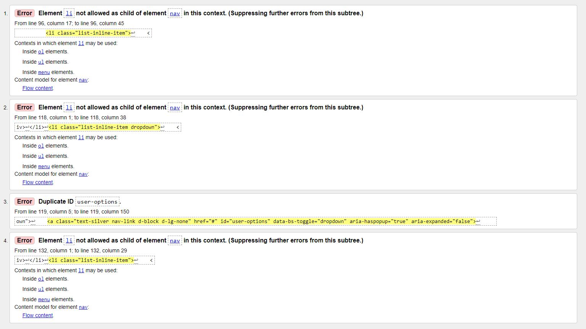

# Testing

Back to [Readme file.](README.md)

## Table of Contents
- [Functionality Testing](#functionality-testing)
- [Browser Compatability](#browser-compatability)
- [Code Validation](#code-validation)
- [Performance Testing](#performance-testing)
- [User Stories Testing](#user-stories-testing)
- [Bugs](#bugs)

---
## Functionality Testing

---
## Browser Compatability

- I tested the appearance and responsiveness of the website across many different devices and browsers. Generally, the appearance and responsiveness looks quite good on the different devices, and there is no difference between the browsers.

- Browsers tested:
    - Brave
    - Chrome
    - Firefox
    - Microsoft Edge
- Devices tested:
    - Windows laptop
    - iPad
    - Android Phone
- Devices tested in DevTools:
    - Moto G4
    - iPhone 6/7/8
    - iPad
- Custom responsive viewport sizes created for testing on larger screens than my laptop:
    - 1280px x 802px (Larger laptop)
    - 1600px x 992px (Desktop)

---
## Code Validation

<br/>

### 1. Testing HTML with [The W3C Markup Validation Service](https://validator.w3.org/)

The following errors were detected on the Home page and these errors were common to all pages.



- The solution for Error 3 was simply to re-name the ID on the mobile-top-header.html page from "user-options" to "user-options-mobile". This page was included with base.html which was where the duplication was coming from.

- The solution for errors 1, 2 and 4 was simply to replace the "nav" element with a "ul" element.

Once those issues were solved there was no more validation issues on any of the pages.

<br/>

### 2. Testing CSS with the [Jigsaw CSS Validation Service ](https://jigsaw.w3.org/css-validator/)

<br/>

No errors were found for the base.css, profile.css or checkout.css files.

### 3. Testing JavaScript with [JSHint](https://jshint.com/)

<br/>

The following JavaScript files and code snippets were tested:

- base.html JavaScript
- wishlist.html JavaScript
- countryfield.js
- games.html JavaScript
- quantity_input_script.html JavaScript
- stripe_elements.js
- bag.html JavaScript

No major errors were discovered in any of the files. Only minor errors such as missing semi-colons and the use of ES6 syntax which was easily sorted.

### 4. Testing Python with [PEP8 online](http://pep8online.com/)

All python files were tested.

There were 3 minor errors encountered that existed in most files:

1. Blank lines containing whitespace.

2. Lines being too long.

3. 2 blank lines not existing between functions.

These problems were easily solved by tabbing and spacing, and also by using parantheses for lines that were too long.

<br/>

---
## Performance Testing

---
## User Stories Testing

---
## Bugs

**Bug:** The dropdown menu for the "My Account" icon was not working with Bootstrap 5.

**Fix:** The solution was to add the following code JavaScript code:

```
<script 
    src="https://cdn.jsdelivr.net/npm/bootstrap@5.0.2/dist/js/bootstrap.bundle.min.js" integrity="sha384-MrcW6ZMFYlzcLA8Nl+NtUVF0sA7MsXsP1UyJoMp4YLEuNSfAP+JcXn/tWtIaxVXM" 
    crossorigin="anonymous">
</script>
```

**Bug:** The Toast popups would not close when the 'X' button was clicked with Bootstrap version 5.

**Fix:** The solution was to: 

1. Firstly, change the 'data-toggle' attribute to 'data-bs-toggle'.

2. Secondly, add the following JavaScript code to the postloadjs block:

```
<script type="text/javascript">
    var toastElList = [].slice.call(document.querySelectorAll('.toast'));
    var toastList = toastElList.map(function(toastEl) {
    // Creates an array of toasts (it only initializes them)
    return new bootstrap.Toast(toastEl); // No need for options; use the default options
    });
    toastList.forEach(toast => toast.show()); // This show them
</script>
```

**Bug:** There was an issue with horizontal scrolling associated with the footer on smaller screen sizes.

**Fix:** The solution was to make each column in the footer row take up the full width of the row on smaller screen sizes.