# Testing

Back to [Readme file.](README.md)

## Table of Contents
- [Functionality Testing](#functionality-testing)
- [Browser Compatability](#browser-compatability)
- [Code Validation](#code-validation)
- [Performance Testing](#performance-testing)
- [User Stories Testing](#user-stories-testing)
- [Bugs](#bugs)

---
## Functionality Testing

---
## Browser Compatability

- I tested the appearance and responsiveness of the website across many different devices and browsers. Generally, the appearance and responsiveness looks quite good on the different devices, and there is no difference between the browsers.

- Browsers tested:
    - Brave
    - Chrome
    - Firefox
    - Microsoft Edge
- Devices tested:
    - Windows laptop
    - iPad
    - Android Phone
- Devices tested in DevTools:
    - Moto G4
    - iPhone 6/7/8
    - iPad
- Custom responsive viewport sizes created for testing on larger screens than my laptop:
    - 1280px x 802px (Larger laptop)
    - 1600px x 992px (Desktop)

---
## Code Validation

<br/>

### 1. Testing HTML with [The W3C Markup Validation Service](https://validator.w3.org/)

The following errors were detected on the Home page and these errors were common to all pages.


- The solution for Error 3 was simply to re-name the ID on the mobile-top-header.html page from "user-options" to "user-options-mobile". This page was included with base.html which was where the duplication was coming from.

- The solution for errors 1, 2 and 4 was simply to replace the "nav" element with a "ul" element.

Once those issues were solved there was no more validation issues on any of the pages.

<br/>

### 2. Testing CSS with the [Jigsaw CSS Validation Service ](https://jigsaw.w3.org/css-validator/)

<br/>

No errors were found for the base.css, profile.css or checkout.css files.

### 3. Testing JavaScript with [JSHint](https://jshint.com/)

<br/>

The following JavaScript files and code snippets were tested:

- base.html JavaScript
- wishlist.html JavaScript
- countryfield.js
- games.html JavaScript
- quantity_input_script.html JavaScript
- stripe_elements.js
- bag.html JavaScript

No major errors were discovered in any of the files. Only minor errors such as missing semi-colons and the use of ES6 syntax which was easily sorted.

### 4. Testing Python with [PEP8 online](http://pep8online.com/)

All python files were tested.

There were 3 minor errors encountered that existed in most files:

1. Blank lines containing whitespace.

2. Lines being too long.

3. 2 blank lines not existing between functions.

These problems were easily solved by tabbing and spacing, and also by using parantheses for lines that were too long.

<br/>

---
## Performance Testing

Testing page with Lighthouse in Chrome Dev Tools to optimise performance, accessibility, best practices and SEO

- I carried out Lighthouse tests on the 4 main views on the site: Home, Games, Game Details Page and the Bag / Cart view (with three items in the cart).

- Performance was generally good on desktop but suffered on mobile due to image sizes and the large number of images displayed on the game page.

- This could be improved upon in the future by reducing image sizes and using pagination on the games page.

### Desktop Performance

Home | Games | Game Detail | Bag / Cart
:-------------------------:|:-------------------------:|:-------------------------:|:-------------------------:
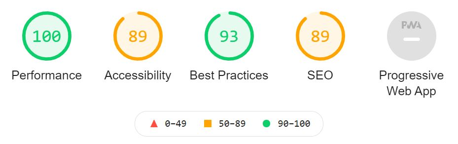 | 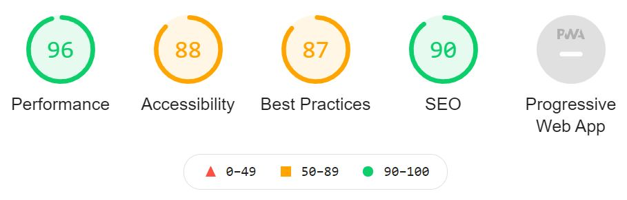 | 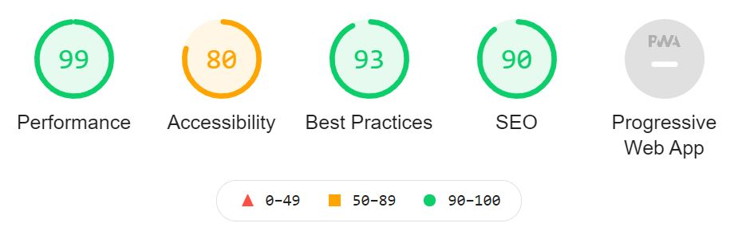 | 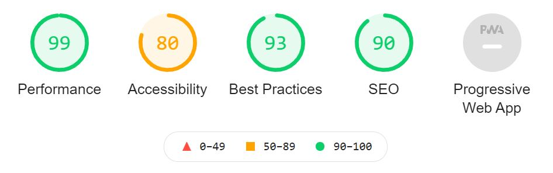

### Mobile Performance

Home | Games | Game Detail | Bag / Cart
:-------------------------:|:-------------------------:|:-------------------------:|:-------------------------:
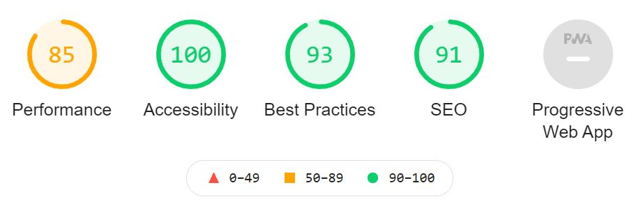 | 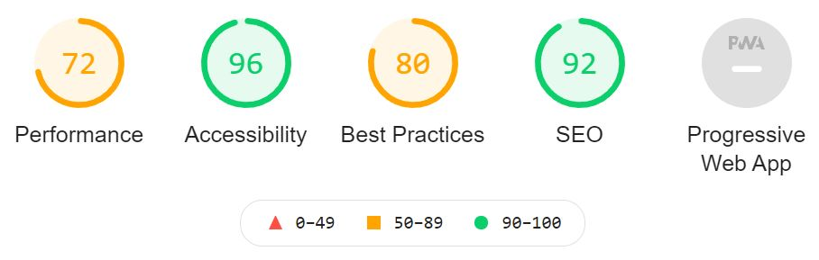 | 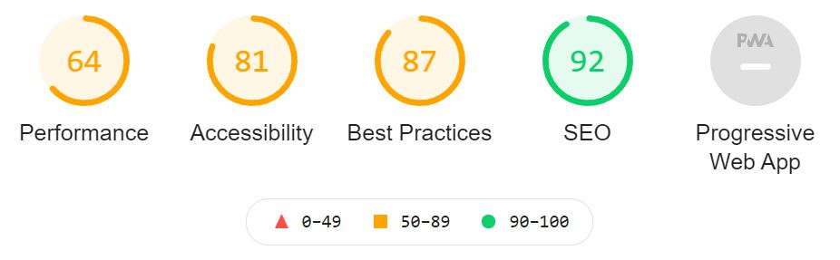 | 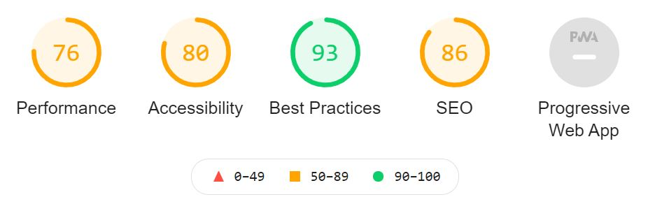

---
## User Stories Testing

As a **first-time visitor**, I want:

1. To be able to view games on the site.

- User can do this by visiting the Games page.

<br/>

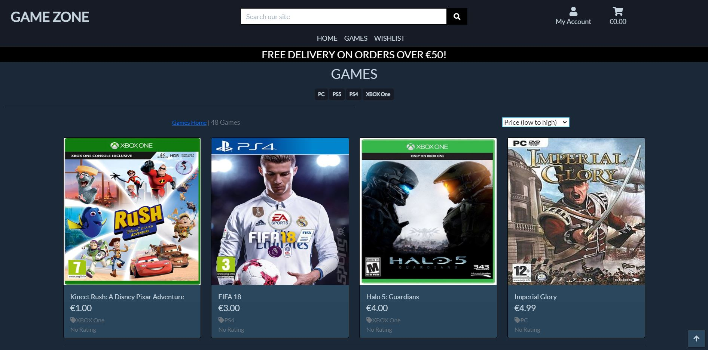

2. To be able to search/sort/filter the games on the site.

- User can search by typing a query into the search bar at the top.

<br/>

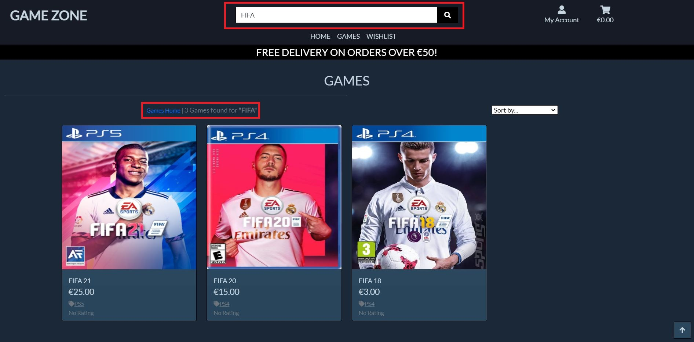

- User can sort by using the select box on the right of the games screen.

<br/>

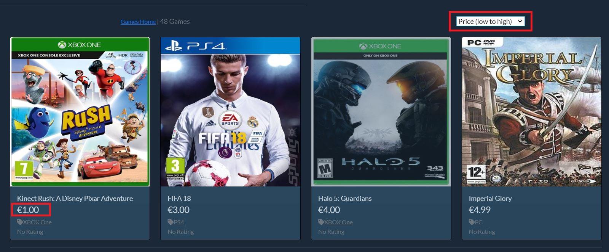

- User can filter by category by using the buttons on top of the games screen.

<br/>

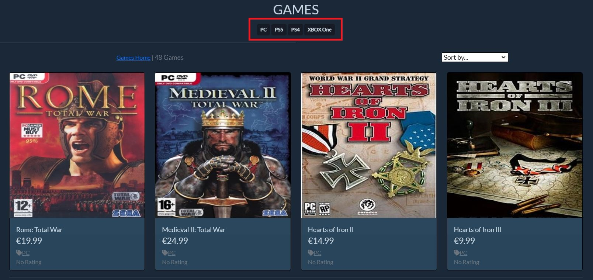

3. To register securely for the site.

- Registration is secure.
- User is asked to enter their email and password twice.

<br/>


- User is also asked to verify their email address.

<br/>


4. To know the price of each game.

- User can easily see the price of each game underneath it's name.

<br/>


5. To be able to add games to the cart.

- Done by clicking the "Add to Bag" button on the game detail page.

<br/>

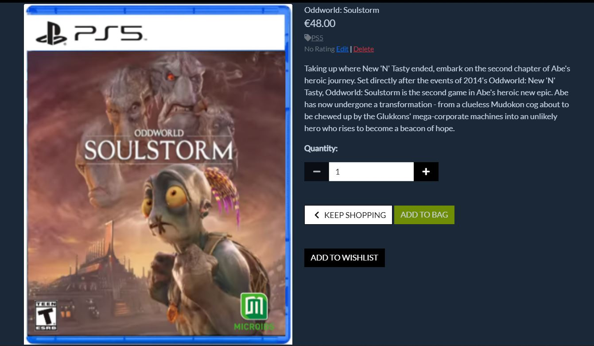

6. To be able to contact the company.

- Company email address is available in footer.

<br/>


7. To be able to get visual feedback when an action is completed.

- Visual feedback is provided by using Toasts, which appear in the top-right of the screen after the user completes an action such as adding a game to the bag/cart.

<br/>

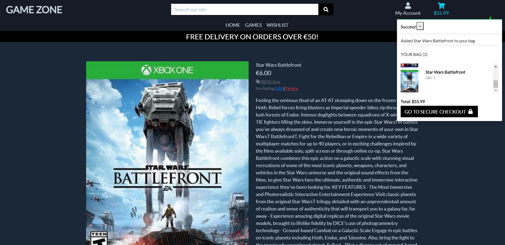

8. To see a visually appealing website.

- A matter of perspective, but I think the colour scheme of the website and all of the images look good :)

9. The website to be intuitive and simple to use.

- The website is intuitive and easy to use, with the navbar containing all the links available across all pages.

<br/>

As a **registered user**, in addition to the above, I want:

1. To be able to easily login to the site.

- Logging-in is easily then and a user can choose to be remembered to make logging-in even easier.

<br/>

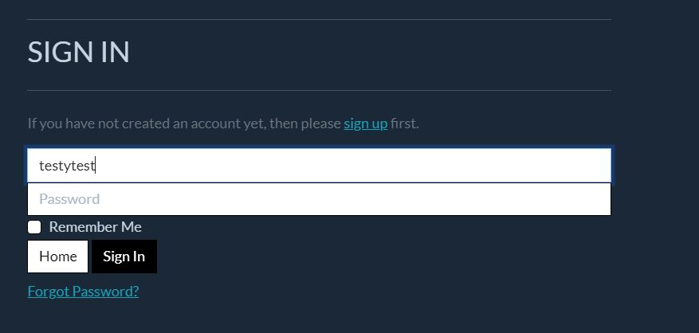

2. To be able to easily add and remove items to and from the cart.

- Adding to the cart can be done through the game detail page as seen in an image above.

- Removing an item from the cart is done by clicking the red "Remove" link below the quantity input box on the bag/cart page.

<br/>

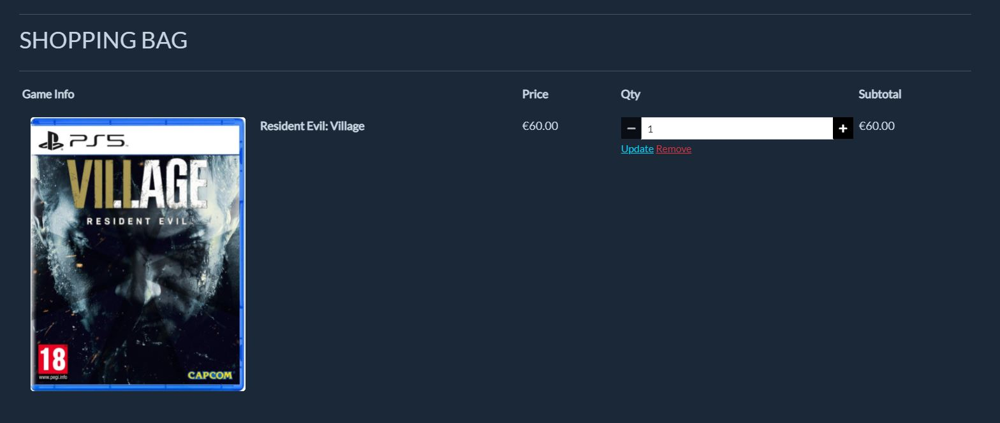

3. To be able to securely purchase items on cart.

- Secure purchasing is done with Stripe payments on the checkout page. 

<br/>

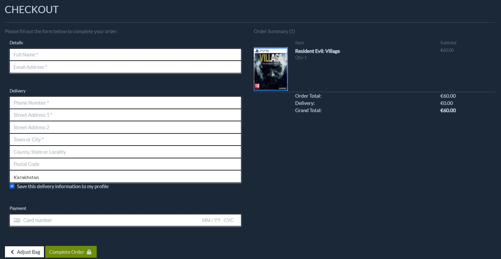

4. To receive a purchase confirmation email.

- Purchase confirmation email is sent to user's email address.

<br/>

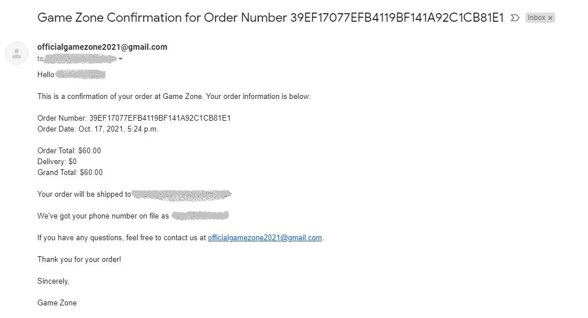

5. To be able to easily update my contact, profile and delivery information.

- This is done via the form on the left of the Profile page.

<br/>

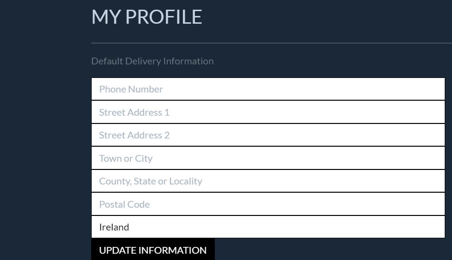

6. To be able to view previous orders

- Can be seen on the right of the Profile page.

<br/>

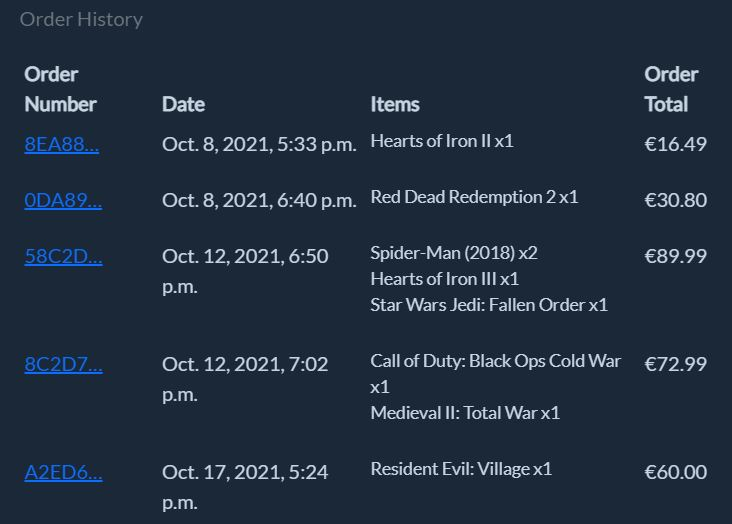

As the **site owner**, I want:

1. To be able to add new games or update existing games in the store.

- Site administrator can add new games to the site using the form on the Add Game page.

<br/>

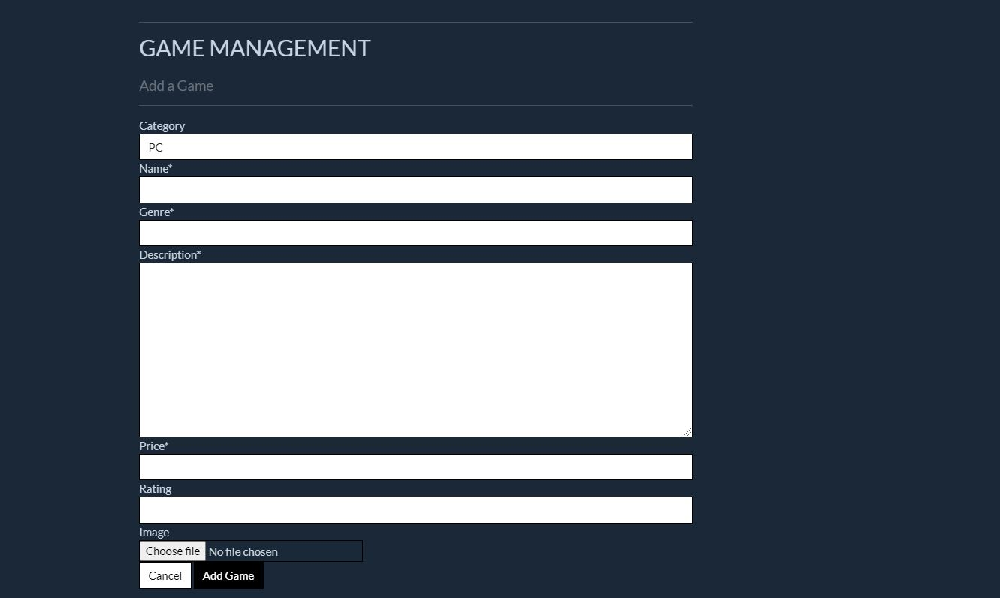

- Site administrator can update games on the Edit Game Page

<br/>

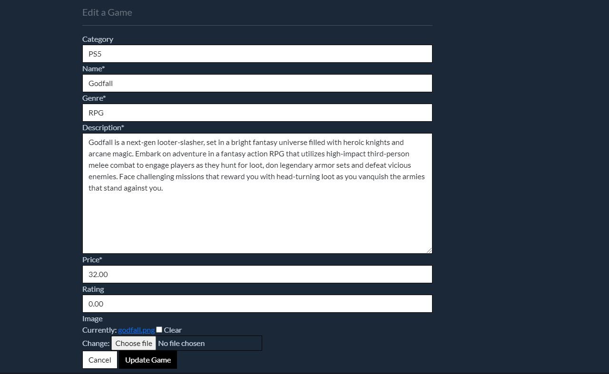

2. To be able to delete games in the store.

- Site administrator can delete a game by clicking the "Red" delete button.

<br/>

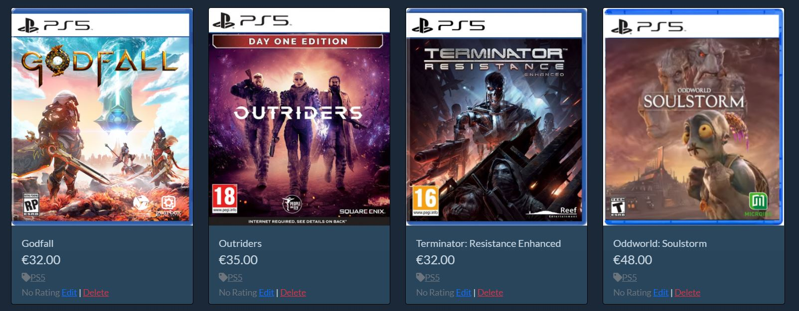

3. To provide a visually appealing website for all screen sizes and devices.

- Website looks well on ipad.

<br/>

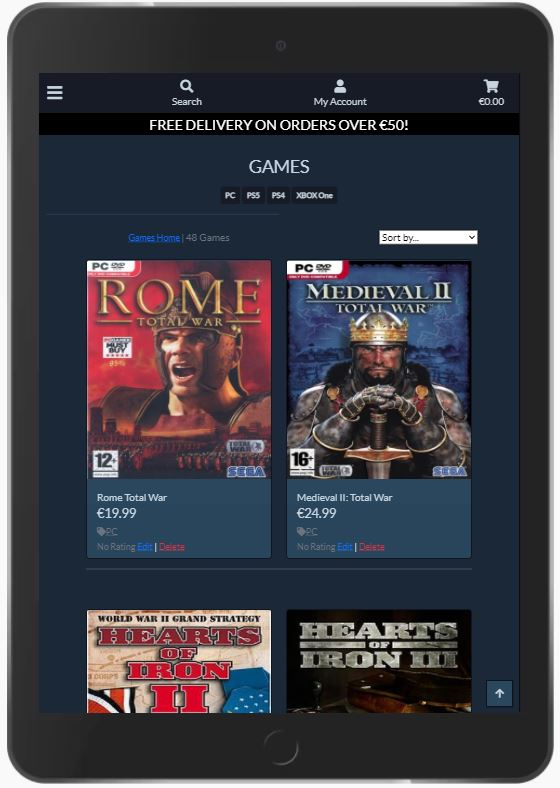

- Website looks well on mobile.

<br/>

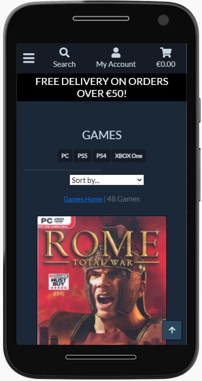

4. To provide a secure payment system for users of the site.

- Secure purchasing is done with Stripe payments on the checkout page. (See one of the images above) 

5. For users to be able to recover their account details.

- This feature could be implemented in a future release of this project, but for now a user can contact the site administrator by using the email in the footer of every page.

6. To be able to access the admin section of the site to view orders made, the items they contain and the delivery information.

- Site administrator can successfully access admin page to manage all items contained in the database.

---
## Bugs

**Bug:** The dropdown menu for the "My Account" icon was not working with Bootstrap 5.

**Fix:** The solution was to add the following code JavaScript code:

```
<script 
    src="https://cdn.jsdelivr.net/npm/bootstrap@5.0.2/dist/js/bootstrap.bundle.min.js" integrity="sha384-MrcW6ZMFYlzcLA8Nl+NtUVF0sA7MsXsP1UyJoMp4YLEuNSfAP+JcXn/tWtIaxVXM" 
    crossorigin="anonymous">
</script>
```

**Bug:** The Toast popups would not close when the 'X' button was clicked with Bootstrap version 5.

**Fix:** The solution was to: 

1. Firstly, change the 'data-toggle' attribute to 'data-bs-toggle'.

2. Secondly, add the following JavaScript code to the postloadjs block:

```
<script type="text/javascript">
    var toastElList = [].slice.call(document.querySelectorAll('.toast'));
    var toastList = toastElList.map(function(toastEl) {
    // Creates an array of toasts (it only initializes them)
    return new bootstrap.Toast(toastEl); // No need for options; use the default options
    });
    toastList.forEach(toast => toast.show()); // This show them
</script>
```

**Bug:** There was an issue with horizontal scrolling associated with the footer on smaller screen sizes.

**Fix:** The solution was to make each column in the footer row take up the full width of the row on smaller screen sizes.